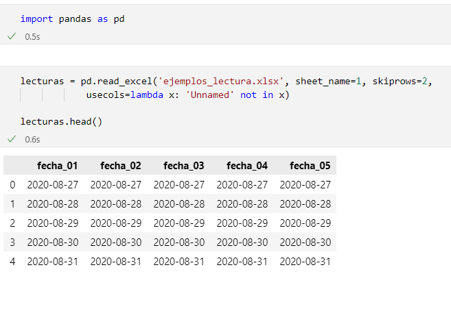

<!-- Estilo y otras configuraciones -->

```{r setup, include=FALSE}
knitr::opts_chunk$set(echo = TRUE)
```

```{css, echo = FALSE}
.box {
  padding: 10px 10px;
  background-color: #E0E0E0;
    border-radius: 5px;
}

```

<!-- Fin -->

Version `r format(Sys.time(), '%d.%m.%y')`


<br/>

::: {.box}
Los enunciados de los ejercicios fueron elaborados por *Leonado Hansa* profesor de ETL en el Máster Universitario en Ciencia de Datos de CUNEF Universidad. Las soluciones propuestas han sido elaboradas por *Carlos Viñals Guitart*, al igual que el documento. 
:::

<br/>
<br/>

## General Tools

**Exercise 1**
Using ```ls``` and ```cd``` in your computer explore your folders and the contents of the folder you use for the Master's dgree. *Remark*: If you use Windows, it is recommendable downloading Git bash for Windows.

**Solution 1**

```ls``` is the bash command to show what is in a folder. For example:

```console
rstudio@c0addac18593:~/etl$ ls
code  data  exercises  logo.png  README.md
```

You can use different commands like ```-la```, this option will show you all the
elements you can find inside the directory you are:

```console
rstudio@c0addac18593:~/etl$ ls -la
total 56
drwxr-xr-x 6 rstudio rstudio  4096 Nov 16 12:19 .
drwxr-xr-x 1 rstudio rstudio  4096 Nov 15 15:55 ..
drwxr-xr-x 2 rstudio rstudio  4096 Oct 29 18:35 code
drwxr-xr-x 4 rstudio rstudio  4096 Oct 29 18:37 data
drwxr-xr-x 2 rstudio rstudio  4096 Nov 16 12:31 exercises
drwxr-xr-x 8 rstudio rstudio  4096 Nov 15 18:05 .git
-rw-r--r-- 1 rstudio rstudio     6 Oct 26 17:03 .gitignore
-rw-r--r-- 1 rstudio rstudio 13461 Oct 22 22:28 logo.png
-rw-r--r-- 1 rstudio rstudio   232 Oct 22 22:28 README.md
-rw-r--r-- 1 rstudio rstudio    26 Oct 26 18:31 .Rhistory
```

Without entering in detail of all the information this command gives us we can comment some 
of it. 

In this case we see the same files and folders like before, but we can also see special files like ```.git```, this files are normally hided of the users view.  And two additional files:
```.``` and ```..``` that refer to the actual directory path and the parent directory
(the one that contains the folder we are in). 

You can see also the permissions you have to the file: ```r``` read, ```w``` write
and ```x``` execute. 

```cd``` is the bash command to navigate between directories. For example:

```console
# We are now in the main folder
rstudio@c0addac18593:~/etl$ ls
code  data  exercises  logo.png  README.md

# We are going to enter the code folder
rstudio@c0addac18593:~/etl$ cd code
rstudio@c0addac18593:~/etl/code$ ls
04a-extract_csv.py  04c-extract_sql.R

# We can turn back to the parent folder
rstudio@c0addac18593:~/etl/code$ cd ..
rstudio@c0addac18593:~/etl$ ls
code  data  exercises  logo.png  README.md
```

<br/>
<br/>

**Exercise 2**
Create in your local Desktop a file called ```testing-bash.ter``` and write in the text "Holi!". Use ```echo``` and ```>``` for this. Then create a folder in your Documents folder named ```carpeta_prueba```. Move the previous file inside this folder and, check with ls you've done it properly. Now use ```cat``` for checking the text actually written in the file. Finally, remove the folder ```carpeta_prueba``` with ```rm```.

**Solution 2**

```console
# TO DO
```

<br/>
<br/>

**Exercise 3**
Run a docker container from the image ```lhansa/cunefark:0.1.0```, as shown in the
Canvas notes. Explore the container with ```ls``` and ```cd```. Create a Git repository
in GitHub and link a folder inside this container to that repo.

**Solution 3**

This exercise can be done with the tools we explain at *Exercise 1*, but it is 
interesting to talk a bit about **Docker** and **Git**. Two very important tools for 
programming in general.

For creating your the container of the exercise you have to open a console and write the
following command:

```console
docker run -it -p 8888:8888 lhansa/cunefark:0.1.0 bash
```

Once the image is downloaded, the container will be running, we can now if it is 
running using ```docker ps```:

```
PS C:\Users\carviagu> docker ps
CONTAINER ID   IMAGE                   COMMAND   CREATED       STATUS         PORTS                                                                                  NAMES
c0addac18593   lhansa/cunefetl:0.1.1   "bash"    3 weeks ago   Up 7 minutes   0.0.0.0:8787->8787/tcp, :::8787->8787/tcp, 0.0.0.0:8888->8888/tcp, :::8888->8888/tcp   amazing_taussig
```

We can access our container using ```docker exec``` command:

```
PS C:\Users\carviagu> docker exec -it amazing_taussig bash
rstudio@c0addac18593:/$
```

<br/>
<br/>

## Extract

### Plain Text

**Exercise 1**
With pandas, from *hipotecas_lectura* file read only the data from the second 
semester of 2020, and including somehow the names of the columns.

**Solution 1**

```{python, warning=FALSE}
import pandas as pd

# We will try with csv format
hipotecas = pd.read_csv('/home/rstudio/etl/data/hipotecas/hipotecas_lectura')

# We can see a glimpse of the object
hipotecas.head()
```

We can see that ```read_csv``` works fine but we only want the second semester of
2020:

```{python}
# WITH PYTHON
# import pandas as pd
# We will keep the column names first
hipotecas = pd.read_csv('/home/rstudio/etl/data/hipotecas/hipotecas_lectura', 
nrows=3) 
cols = list(hipotecas.columns)

# We will skip first 7 rows and read only the next 6 ones
hipotecas = pd.read_csv('/home/rstudio/etl/data/hipotecas/hipotecas_lectura', 
skiprows=7, nrows=6, names=cols)

hipotecas.head(6)
```

<br/>
<br/>

**Exercise 2**
With readr, from the ```hipotecas_lectura``` file read only the data from the first semester of 2020, and including somehow the names of the columns.

**Solution 2**

```{r}
# WITH R
library(readr)

# Searching dataframe column names
names <- names(read_csv('/home/rstudio/etl/data/hipotecas/hipotecas_lectura'))

# Reading data frame 
hipotecas2 <- read_csv('/home/rstudio/etl/data/hipotecas/hipotecas_lectura', 
                       skip = 13, n_max = 6, col_names = names)

hipotecas2
```

<br/>
<br/>

**Exercise 3**
Try your best reading the original file downloaded from the INE's site, ```hipotecas_numero_ine.csv```. *Remark*: you may need to specify that the encoding is "ISO-8859-2".

**Solution 3**
```{r}
# WITH R
hip_ine <- read.csv2('/home/rstudio/etl/data/hipotecas/hipotecas_numero_ine.csv', 
                    skip = 6, nrows = 18 , fileEncoding = 'ISO-8859-2')

head(hip_ine)
```

```{python}
# import pandas as pd
hip_ine = pd.read_csv('/home/rstudio/etl/data/hipotecas/hipotecas_numero_ine.csv', 
                      skiprows=6, nrows=18, encoding='ISO-8859-2', delimiter=';')

hip_ine.head()
```

<br/>

### Excel

**Exercise 1**
Read with Python and ```pandas``` the second sheet of the ```ejemplos_lecturas.xlsx```
file.

**Solution 1**

We can see here the solution for this exercise using **jupyter notebook**:



<br/>

### SQL

**Exercise 1**
In R, download all the rows from ```IndexPrice``` in **indexKaggle.SQlite** whose
region is United States or Europe, from 2019 until the end of the period.

**Solution 1**

```{r}
library(dplyr)

# Connecting to the database
conn <- DBI::dbConnect(RSQLite::SQLite(), '../data/indexKaggle.sqlite')

# Listing tables
DBI::dbListTables(conn)

# Reading information about IndexPrice
DBI::dbListFields(conn, 'IndexPrice')
DBI::dbListFields(conn, 'IndexMeta')

# We need to join both tables so we want to know the region of the stock
# index and then extract only 2009 values
query = "
SELECT p.stock_index, date, open, high, 
low, close, adj_close, volume
FROM IndexPrice p INNER JOIN IndexMeta m ON(p.stock_index == m.stock_index)
WHERE (m.region == 'United States' OR m.region == 'Europe') AND
strftime('%Y', p.date) == '2009' 
"

table <- tbl(conn, sql(query))

table %>% collect() # will execute the query

# Closing connection
DBI::dbDisconnect(conn)
```

<br/>
<br/>

**Exercise 2**
In R and Python, from **indexKaggle.SQlite** download a table containing all the
close prices and volume since 2007 until 2010 whose currency is dollars or euros.

**Solution 2**

In **R**:
```{r}
# library(dplyr)

# Connecting to the database
conn <- DBI::dbConnect(RSQLite::SQLite(), '../data/indexKaggle.sqlite')

# We need to join both tables so we want to know the currency of the stock
# index
query <- "
SELECT p.stock_index, adj_close, volume
FROM IndexPrice p INNER JOIN IndexMeta m ON(p.stock_index == m.stock_index)
WHERE (m.currency == 'EUR' OR m.currency == 'USD') AND 
strftime('%Y', p.date) BETWEEN '2007' AND '2009'
"

table <- tbl(conn, sql(query))

table %>% collect() # will execute the query

# Closing connection
DBI::dbDisconnect(conn)
```

In **Python**:
```{python}
# import pandas as pd
from sqlalchemy import create_engine
engine = create_engine('sqlite:///../data/indexKaggle.sqlite')

query = '''
SELECT p.stock_index, adj_close, volume
FROM IndexPrice p INNER JOIN IndexMeta m ON(p.stock_index == m.stock_index)
WHERE (m.currency == 'EUR' OR m.currency == 'USD') AND 
strftime('%Y', p.date) BETWEEN '2007' AND '2009'
'''

table = pd.read_sql(query, engine)
table.head()

```

<br/>
<br/>

**Exercise 3** 
With R or Python, use the ```elections2016.sqlite``` database for extracting some data. We want a table that includes all the adjusted polls for Trump and Clinton in the Ohio and Pennsylvania states, along with the final results, order from the newest poll to the oldest (considering only the ```enddate``` column). The final table will have the next columns:

* (From the ```Polls``` table) state, enddate, grade, samplesize, adjpoll_clinton, adjpoll_trump.
* (From the ```Results``` table) electoral_votes, clinton, trump.

**Solution 3**

With **R**:
```{r}
conn <- DBI::dbConnect(RSQLite::SQLite(), '../data/elections2016.sqlite')

DBI::dbListFields(conn, 'Polls')

DBI::dbListFields(conn, 'Results')

query <- "
SELECT p.state, p.enddate, p.grade, p.samplesize, p.adjpoll_clinton, 
p.adjpoll_trump, r.electoral_votes, r.clinton, r.trump
FROM Polls p INNER JOIN Results r ON(p.state == r.state)
WHERE p.state == 'Ohio' OR p.state == 'Pennsylvania'
ORDER BY p.enddate DESC
"

table <- tbl(conn, sql(query))
table %>% collect() # will execute the query

```

With **Python**:
```{python}
# import pandas as pd
# from sqlalchemy import create_engine
engine = create_engine('sqlite:///../data/elections2016.sqlite')

query = '''
SELECT p.state, p.enddate, p.grade, p.samplesize, p.adjpoll_clinton, 
p.adjpoll_trump, r.electoral_votes, r.clinton, r.trump
FROM Polls p INNER JOIN Results r ON(p.state == r.state)
WHERE p.state == 'Ohio' OR p.state == 'Pennsylvania'
ORDER BY p.enddate DESC
'''

table = pd.read_sql(query, engine)
table.head()
```

<br/>
<br/>

**Exercise 4** 
In the **Pets** database, check if there is any owner with more the one pet.

**Solution 4**

With **R**:
```{r}
conn <- DBI::dbConnect(RSQLite::SQLite(), '../data/pets.sqlite')

DBI::dbListTables(conn)

DBI::dbListFields(conn, 'Owners')
DBI::dbListFields(conn, 'Pets')

query <- "
SELECT o.OwnerID, count(p.PetID)
FROM Owners o INNER JOIN Pets p ON(o.OwnerID == p.OwnerID)
GROUP BY o.OwnerID
HAVING count(p.PetID) > 1
"

table <- tbl(conn, sql(query))
table %>% collect() # will execute the query

```


With **Python**:
```{python}
# import pandas as pd
# from sqlalchemy import create_engine
engine = create_engine('sqlite:///../data/pets.sqlite')

query = '''
SELECT o.OwnerID, count(p.PetID)
FROM Owners o INNER JOIN Pets p ON(o.OwnerID == p.OwnerID)
GROUP BY o.OwnerID
HAVING count(p.PetID) > 1
'''

table = pd.read_sql(query, engine)
table.head()
```

<br/>
<br/>

**Exercise 5**
Calculate the income per day considering all procedures.

**Solution5**

With **R**:
```{r}
conn <- DBI::dbConnect(RSQLite::SQLite(), '../data/pets.sqlite')

DBI::dbListTables(conn)

DBI::dbListFields(conn, 'ProceduresDetails')
DBI::dbListFields(conn, 'ProceduresHistory')

query <- "
SELECT h.date, AVG(d.price)
FROM ProceduresHistory h INNER JOIN ProceduresDetails d 
    ON(h.ProcedureType == d.ProcedureType AND 
        h.ProcedureSubCode == d.ProcedureSubCode) 
GROUP BY h.date
"

table <- tbl(conn, sql(query))
table %>% collect() # will execute the query

```


With **Python**:
```{python}
# import pandas as pd
# from sqlalchemy import create_engine
engine = create_engine('sqlite:///../data/pets.sqlite')

query = '''
SELECT h.date, AVG(d.price)
FROM ProceduresHistory h INNER JOIN ProceduresDetails d 
    ON(h.ProcedureType == d.ProcedureType AND 
        h.ProcedureSubCode == d.ProcedureSubCode) 
GROUP BY h.date
'''

table = pd.read_sql(query, engine)
table.head()
```

<br/>
<br/>

**Exercise 6**
Using ```strftime()```, calculate the income per month considering only the 
transactions done by owners from the largest city in the database (the largest
city is the one with a larger number of owners)

**Solution 6**

With **R**:
```{r}
conn <- DBI::dbConnect(RSQLite::SQLite(), '../data/pets.sqlite')

query1 <- "
SELECT City, COUNT(OwnerID)
FROM Owners
GROUP BY City
ORDER BY COUNT(OwnerID) DESC
LIMIT 1
"

table <- tbl(conn, sql(query1))
table %>% collect() # will execute the query

query2 <- "
SELECT h.date, AVG(d.price)
FROM ProceduresHistory h INNER JOIN ProceduresDetails d 
    ON(h.ProcedureType == d.ProcedureType AND 
        h.ProcedureSubCode == d.ProcedureSubCode) 
        INNER JOIN Pets p ON (h.PetID == p.PetID)
WHERE p.OwnerID IN 
                (SELECT OwnerID 
                  FROM Owners 
                  WHERE City == 'Southfield')
GROUP BY h.date
"

table <- tbl(conn, sql(query2))
table %>% collect() # will execute the query
```

The same query will be used for Python but with ```sqlalchemy``` syntax.

<br/>
<br/>

## Transform

### Missing Values